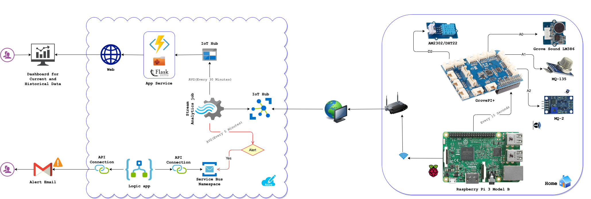
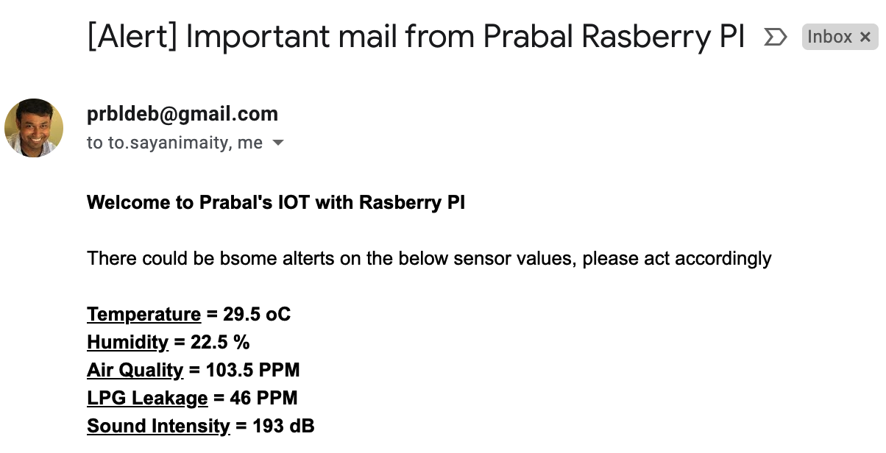
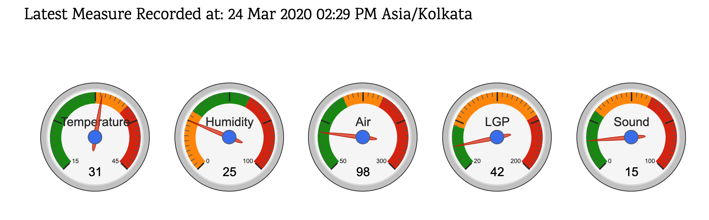
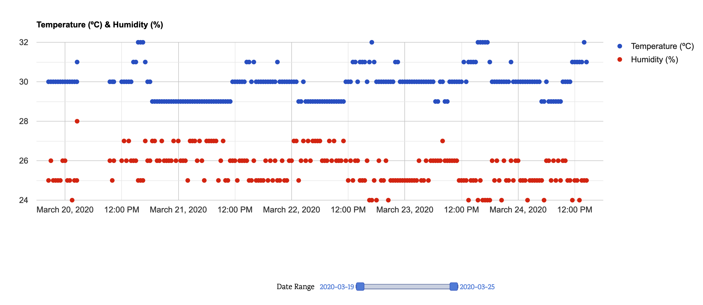
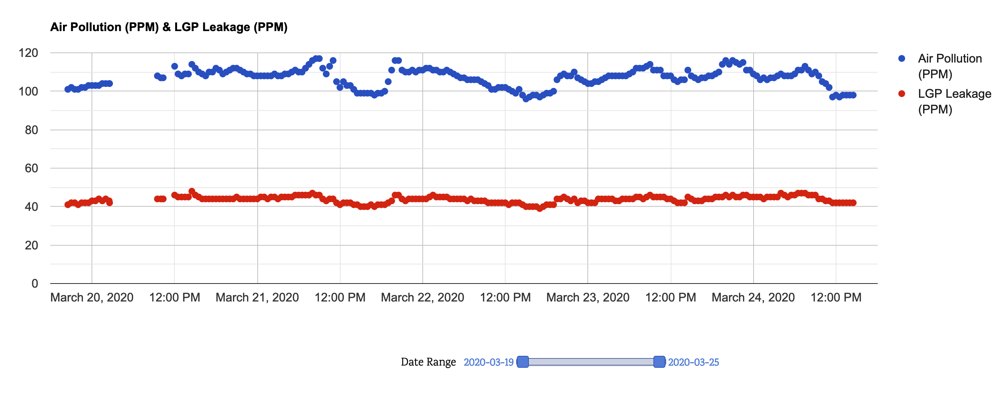
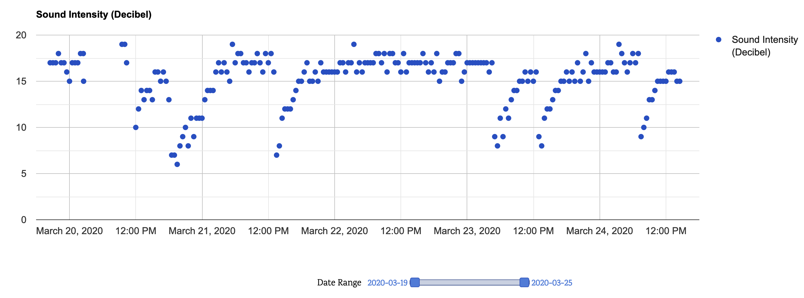
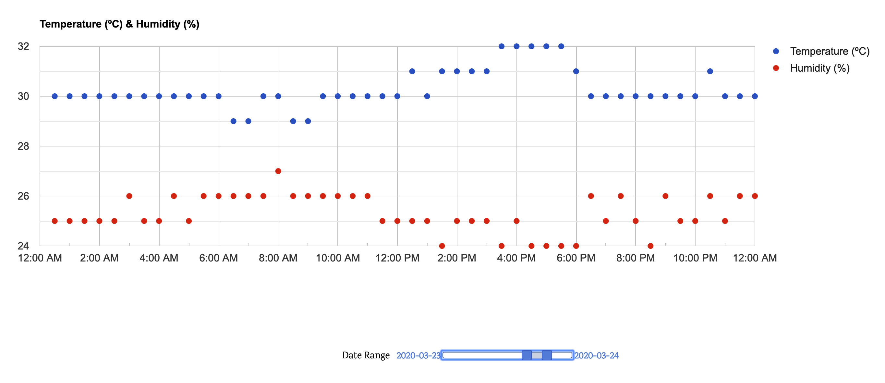

# Azure IoT based Home Sensors Dashboard and Alerts

Sample for Azure IoT based Home Sensors (**Temperature**, **Humidity**, **Air Quality**, **LPG Leakage** and **Sound**) Dashboard and Alerts with historical data

## Architecture

## Devices

1. [Raspberry Pi 3 Model B](https://www.raspberrypi.org/products/raspberry-pi-3-model-b/)
2. [GrovePI Plus](https://www.seeedstudio.com/GrovePi-p-2241.html)
3. [Grove - Temperature & Humidity Sensor AM2302/DHT22](http://wiki.seeedstudio.com/Grove-TemperatureAndHumidity_Sensor/)
4. [Grove - Sound Sensor LM386](http://wiki.seeedstudio.com/Grove-Sound_Sensor/)
5. [Air Quality & Hazardous Gas Sensor MQ-135](https://robokits.co.in/sensors/gas-sensors/mq-135-air-quality-hazardous-gas-sensor-module)
6. [Smoke Methane Gas & Liquefied Flammable Gas Sensor MQ-2](https://robokits.co.in/sensors/gas-sensors/mq-2-smoke-methane-gas-liquefied-flammable-gas-sensor-module)
7. [Wifi Router with Internet Connection](https://www.amazon.in/)
8. [Azure Subscription](http://portal.azure.com/)
9. [Gmail Account](https://mail.google.com/)

## Installation
[TODO]

## Outcome

1. Every 5 minutes there will be check for alerts, if the sensors measures crossed pre-defined threshold (average of 5 minutes), example `average temperature for 5 minutes >= 35 degree celsius`

**Sample Alert:**

2. Dashboard with latest measures from all sensors as well as historical data of measures in graphical format (can be filtered with Date)

**Sample Dashboard Latest Measures:**

**Sample Dashboard Historical Data:**

**Sample Dashboard with Date Filter:**
