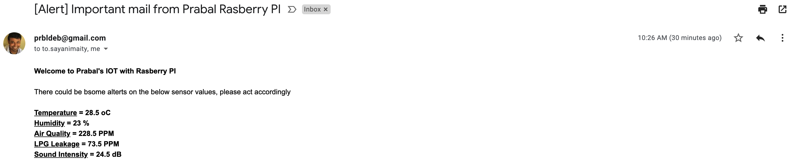

# azure-iot-sample-home-alrets

Azure IOT Sample for Home based Alert and Dashboard with historical data of Temperature, Humidity, Air Quality, LPG Leakage and Sound.

## Architecture

## Devices

## Installation

## Outcome

1. Every 5 minutes there will be check for alerts, if the sensors measures crossed pre-defined threshold (average of 5 minutes), example `average temperature for 5 minutes >= 35 degree celsius`

**Sample Alert:**

2. Dashboard with latest measures from all sensors as well as historical data of measures in graphical format (can be filtered with data)

**Sample Dashboard Latest Measures:**

**Sample Dashboard Historical Data:**

**Sample Dashboard with Date Filter:**
